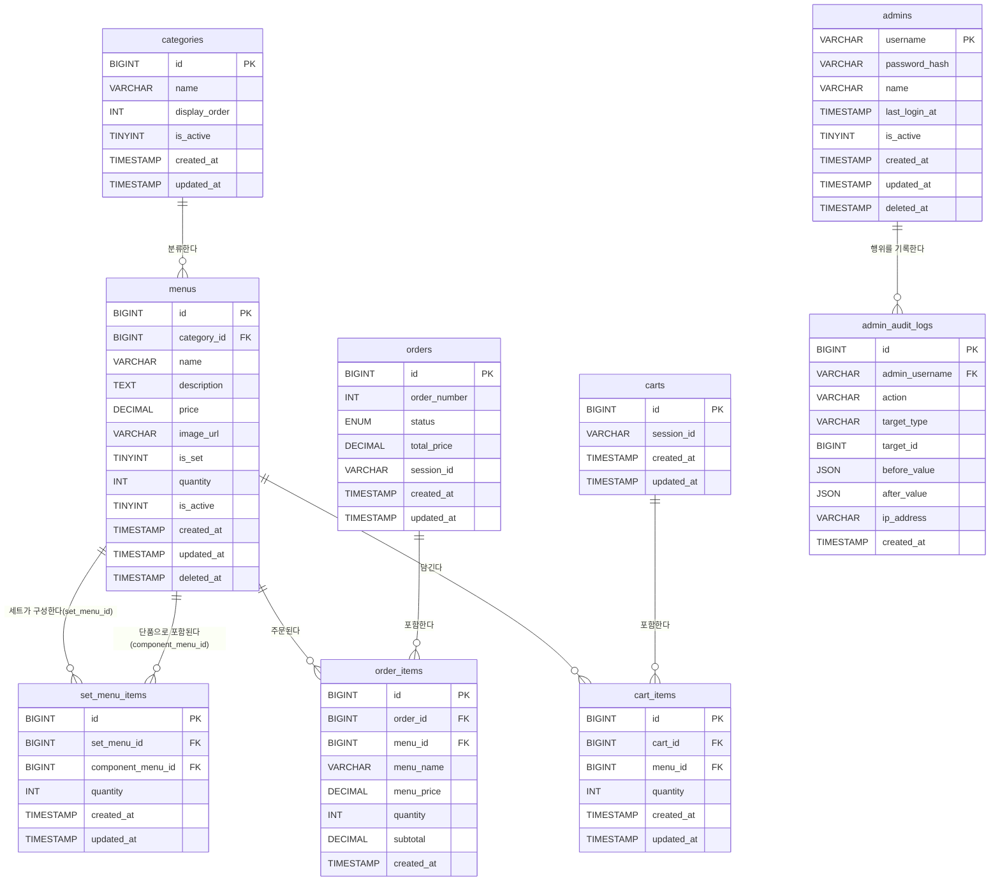

# 버거킹 키오스크 시스템 - DB 설계 명세서

## 1. 개요

### 1.1 프로젝트 목적

고객이 매장 키오스크에서 카테고리별 메뉴(단품/세트)를 조회·장바구니에 담아 주문하고, 관리자가 백오피스에서 카테고리·메뉴를 관리하며 모든 관리자 행위가 감사 로그로 남는 키오스크 시스템의 데이터베이스이다.

### 1.2 DB 환경 정보

| 항목 | 값 |
|---|---|
| DBMS | MySQL 8.x |
| 문자셋 (Character Set) | `utf8mb4` |
| Collation | `utf8mb4_unicode_ci` |
| 스토리지 엔진 | InnoDB |
| 시간 타입 | `TIMESTAMP` (`DEFAULT CURRENT_TIMESTAMP`) |
| 금액 단위 | `DECIMAL(10,0)` (원 단위, 소수점 없음) |
| 논리값 표현 | `TINYINT(1)` (BOOLEAN의 MySQL 관례 표현) |

### 1.3 설계 원칙 요약

- 모든 테이블은 `created_at`, `updated_at`을 가진다. `updated_at`은 `DEFAULT CURRENT_TIMESTAMP ON UPDATE CURRENT_TIMESTAMP`로 자동 갱신한다.
- 논리 삭제가 필요한 테이블(`menus`, `admins`)만 `deleted_at TIMESTAMP NULL`을 가진다. 그 외 테이블은 `is_active` 플래그(예: `categories`)나 하드 삭제(예: `carts`, `cart_items`, `set_menu_items`)로 상태를 관리한다.
- PK는 별도 명시가 없는 한 `BIGINT UNSIGNED AUTO_INCREMENT`이다. 예외: `orders.order_number`(애플리케이션 채번), `admin_audit_logs`는 INSERT-only.
- 모든 FK는 `ON DELETE` / `ON UPDATE` 정책을 명시한다.
- 금액 컬럼은 `DECIMAL(10,0) UNSIGNED`로 저장한다(원 단위 정수, 음수 불가).
- 모든 컬럼에 `COMMENT`를 명시한다.

---

## 2. ERD 다이어그램



---

## 3. 테이블 목록

| 테이블명 | 한글명 | 설명 |
|---|---|---|
| `categories` | 카테고리 | 메뉴를 분류하는 상위 카테고리 |
| `menus` | 메뉴 | 단품/세트 상품 정보 및 재고 |
| `set_menu_items` | 세트 메뉴 구성 | 세트 메뉴 ↔ 구성 단품 매핑 |
| `orders` | 주문 | 고객 주문 헤더 (101번부터 채번) |
| `order_items` | 주문 구성품 | 주문에 포함된 메뉴 및 스냅샷 |
| `carts` | 장바구니 세션 | 세션 1개당 1개의 장바구니 헤더 |
| `cart_items` | 장바구니 항목 | 장바구니에 담긴 개별 메뉴 항목 |
| `admins` | 관리자 | 백오피스 관리자 계정 |
| `admin_audit_logs` | 관리자 감사 로그 | 관리자 행위 이력 (INSERT-only) |
| `order_number_sequence` | 주문번호 시퀀스 | `order_number` 원자적 채번용 카운터 |

---

## 4. 테이블 상세 명세

### 4.1 `categories` — 카테고리

메뉴를 화면에 노출할 때 사용하는 분류 단위. 소프트 삭제 없이 `is_active`로 노출 여부만 제어한다(카테고리는 삭제보다 비활성화가 자연스러운 운영 방식).

**컬럼 명세**

| 컬럼명 | 타입 | NULL | 기본값 | 설명 |
|---|---|---|---|---|
| id | BIGINT UNSIGNED | N | AUTO_INCREMENT | 카테고리 고유 ID (PK) |
| name | VARCHAR(50) | N | - | 카테고리명 (예: 버거, 사이드, 음료) |
| display_order | INT | N | 0 | 키오스크 화면 노출 순서 (오름차순) |
| is_active | TINYINT(1) | N | 1 | 노출 활성 여부 (1: 노출, 0: 숨김) |
| created_at | TIMESTAMP | N | CURRENT_TIMESTAMP | 생성 시각 |
| updated_at | TIMESTAMP | N | CURRENT_TIMESTAMP | 수정 시각 (자동 갱신) |

**제약 조건**
- PK: `id`
- UK: `uq_categories_name` (`name`)

**인덱스**
- `idx_categories_display_order` (`display_order`) — 노출 순서 정렬 조회
- `idx_categories_is_active` (`is_active`) — 활성 카테고리 필터링

**DDL**

```sql
CREATE TABLE categories (
    id             BIGINT UNSIGNED NOT NULL AUTO_INCREMENT COMMENT '카테고리 고유 ID',
    name           VARCHAR(50)     NOT NULL                COMMENT '카테고리명',
    display_order  INT             NOT NULL DEFAULT 0      COMMENT '노출 순서(오름차순)',
    is_active      TINYINT(1)      NOT NULL DEFAULT 1      COMMENT '노출 활성 여부(1:노출, 0:숨김)',
    created_at     TIMESTAMP       NOT NULL DEFAULT CURRENT_TIMESTAMP COMMENT '생성 시각',
    updated_at     TIMESTAMP       NOT NULL DEFAULT CURRENT_TIMESTAMP ON UPDATE CURRENT_TIMESTAMP COMMENT '수정 시각',
    PRIMARY KEY (id),
    UNIQUE KEY uq_categories_name (name),
    KEY idx_categories_display_order (display_order),
    KEY idx_categories_is_active (is_active)
) ENGINE=InnoDB DEFAULT CHARSET=utf8mb4 COLLATE=utf8mb4_unicode_ci COMMENT='메뉴 카테고리';
```

---

### 4.2 `menus` — 메뉴

버거킹 개별 상품(단품/세트 공통)을 저장한다. `is_set = 1`인 레코드는 `set_menu_items`를 통해 구성 단품을 정의한다. `quantity = 0`이면 재고 소진으로 간주해 주문이 차단된다.

**컬럼 명세**

| 컬럼명 | 타입 | NULL | 기본값 | 설명 |
|---|---|---|---|---|
| id | BIGINT UNSIGNED | N | AUTO_INCREMENT | 메뉴 고유 ID (PK) |
| category_id | BIGINT UNSIGNED | N | - | 소속 카테고리 (FK → categories.id) |
| name | VARCHAR(100) | N | - | 메뉴명 |
| description | TEXT | Y | NULL | 메뉴 상세 설명 |
| price | DECIMAL(10,0) UNSIGNED | N | - | 판매 가격 (원) |
| image_url | VARCHAR(500) | Y | NULL | 이미지 경로(URL) |
| is_set | TINYINT(1) | N | 0 | 세트 메뉴 여부 (1: 세트, 0: 단품) |
| quantity | INT UNSIGNED | N | 0 | 재고 수량 (0이면 품절) |
| is_active | TINYINT(1) | N | 1 | 판매 활성 여부 |
| created_at | TIMESTAMP | N | CURRENT_TIMESTAMP | 생성 시각 |
| updated_at | TIMESTAMP | N | CURRENT_TIMESTAMP | 수정 시각 (자동 갱신) |
| deleted_at | TIMESTAMP | Y | NULL | 소프트 삭제 시각 |

**제약 조건**
- PK: `id`
- FK: `fk_menus_category` `category_id` → `categories.id` (`ON DELETE RESTRICT ON UPDATE CASCADE`)
- CHECK: `chk_menus_price` (`price >= 0`)
- CHECK: `chk_menus_quantity` (`quantity >= 0`)

**인덱스**
- `idx_menus_category_id` (`category_id`)
- `idx_menus_is_set` (`is_set`)
- `idx_menus_is_active` (`is_active`)
- `idx_menus_deleted_at` (`deleted_at`)

**DDL**

```sql
CREATE TABLE menus (
    id            BIGINT UNSIGNED         NOT NULL AUTO_INCREMENT COMMENT '메뉴 고유 ID',
    category_id   BIGINT UNSIGNED         NOT NULL                COMMENT '소속 카테고리 ID',
    name          VARCHAR(100)            NOT NULL                COMMENT '메뉴명',
    description   TEXT                    NULL                    COMMENT '메뉴 상세 설명',
    price         DECIMAL(10,0) UNSIGNED  NOT NULL                COMMENT '판매 가격(원)',
    image_url     VARCHAR(500)            NULL                    COMMENT '이미지 경로(URL), 서버 업로드 후 저장',
    is_set        TINYINT(1)              NOT NULL DEFAULT 0      COMMENT '세트 메뉴 여부(1:세트, 0:단품)',
    quantity      INT UNSIGNED            NOT NULL DEFAULT 0      COMMENT '재고 수량(0이면 품절)',
    is_active     TINYINT(1)              NOT NULL DEFAULT 1      COMMENT '판매 활성 여부(1:판매중, 0:숨김)',
    created_at    TIMESTAMP               NOT NULL DEFAULT CURRENT_TIMESTAMP COMMENT '생성 시각',
    updated_at    TIMESTAMP               NOT NULL DEFAULT CURRENT_TIMESTAMP ON UPDATE CURRENT_TIMESTAMP COMMENT '수정 시각',
    deleted_at    TIMESTAMP               NULL                    COMMENT '소프트 삭제 시각(NULL이면 활성)',
    PRIMARY KEY (id),
    CONSTRAINT fk_menus_category FOREIGN KEY (category_id) REFERENCES categories (id)
        ON DELETE RESTRICT ON UPDATE CASCADE,
    CONSTRAINT chk_menus_price CHECK (price >= 0),
    CONSTRAINT chk_menus_quantity CHECK (quantity >= 0),
    KEY idx_menus_category_id (category_id),
    KEY idx_menus_is_set (is_set),
    KEY idx_menus_is_active (is_active),
    KEY idx_menus_deleted_at (deleted_at)
) ENGINE=InnoDB DEFAULT CHARSET=utf8mb4 COLLATE=utf8mb4_unicode_ci COMMENT='메뉴(단품/세트)';
```

**비고**: `category_id`는 `ON DELETE RESTRICT`로, 메뉴가 하나라도 남아있는 카테고리는 삭제할 수 없다(카테고리는 하드 삭제가 가능하므로 고아 메뉴 방지). 카테고리를 없애려면 먼저 소속 메뉴를 다른 카테고리로 이동하거나 소프트 삭제해야 한다.

---

### 4.3 `set_menu_items` — 세트 메뉴 구성

세트 메뉴(`is_set=1`)와 그 구성 단품(`is_set=0`) 사이의 N:M 관계를 정의하는 매핑 테이블.

**컬럼 명세**

| 컬럼명 | 타입 | NULL | 기본값 | 설명 |
|---|---|---|---|---|
| id | BIGINT UNSIGNED | N | AUTO_INCREMENT | 매핑 고유 ID (PK) |
| set_menu_id | BIGINT UNSIGNED | N | - | 세트 메뉴 ID (FK → menus.id) |
| component_menu_id | BIGINT UNSIGNED | N | - | 구성 단품 메뉴 ID (FK → menus.id) |
| quantity | INT UNSIGNED | N | 1 | 세트 내 해당 단품 수량 |
| created_at | TIMESTAMP | N | CURRENT_TIMESTAMP | 생성 시각 |
| updated_at | TIMESTAMP | N | CURRENT_TIMESTAMP | 수정 시각 (자동 갱신) |

**제약 조건**
- PK: `id`
- FK: `fk_smi_set_menu` `set_menu_id` → `menus.id` (`ON DELETE CASCADE ON UPDATE CASCADE`)
- FK: `fk_smi_component_menu` `component_menu_id` → `menus.id` (`ON DELETE RESTRICT ON UPDATE CASCADE`)
- UK: `uq_smi_set_component` (`set_menu_id`, `component_menu_id`)
- CHECK: `chk_smi_quantity` (`quantity > 0`)
- CHECK: `chk_smi_not_self` (`set_menu_id <> component_menu_id`)

**인덱스**
- `idx_smi_set_menu_id` (`set_menu_id`)
- `idx_smi_component_menu_id` (`component_menu_id`)

**DDL**

```sql
CREATE TABLE set_menu_items (
    id                  BIGINT UNSIGNED NOT NULL AUTO_INCREMENT COMMENT '매핑 고유 ID',
    set_menu_id         BIGINT UNSIGNED NOT NULL                COMMENT '세트 메뉴 ID(menus.is_set=1)',
    component_menu_id   BIGINT UNSIGNED NOT NULL                COMMENT '구성 단품 메뉴 ID(menus.is_set=0)',
    quantity            INT UNSIGNED    NOT NULL DEFAULT 1      COMMENT '세트 내 해당 단품 수량',
    created_at          TIMESTAMP       NOT NULL DEFAULT CURRENT_TIMESTAMP COMMENT '생성 시각',
    updated_at          TIMESTAMP       NOT NULL DEFAULT CURRENT_TIMESTAMP ON UPDATE CURRENT_TIMESTAMP COMMENT '수정 시각',
    PRIMARY KEY (id),
    CONSTRAINT fk_smi_set_menu FOREIGN KEY (set_menu_id) REFERENCES menus (id)
        ON DELETE CASCADE ON UPDATE CASCADE,
    CONSTRAINT fk_smi_component_menu FOREIGN KEY (component_menu_id) REFERENCES menus (id)
        ON DELETE RESTRICT ON UPDATE CASCADE,
    CONSTRAINT uq_smi_set_component UNIQUE (set_menu_id, component_menu_id),
    CONSTRAINT chk_smi_quantity CHECK (quantity > 0),
    CONSTRAINT chk_smi_not_self CHECK (set_menu_id <> component_menu_id),
    KEY idx_smi_set_menu_id (set_menu_id),
    KEY idx_smi_component_menu_id (component_menu_id)
) ENGINE=InnoDB DEFAULT CHARSET=utf8mb4 COLLATE=utf8mb4_unicode_ci COMMENT='세트 메뉴 구성 매핑';
```

**비고**: `component_menu_id`는 `ON DELETE RESTRICT`로 설정하여, 살아있는 세트에 포함된 단품을 실수로 하드 삭제하지 못하게 막는다(단품 판매 중단은 `menus.is_active=0` 또는 소프트 삭제로 처리하고, 세트 구성 자체는 유지).

---

### 4.4 `order_number_sequence` — 주문번호 채번 카운터

`orders.order_number`를 동시성 안전하게 채번하기 위한 단일 행 카운터 테이블. 상세 전략은 [6. order_number 채번 전략](#6-order_number-채번-전략) 참조.

**컬럼 명세**

| 컬럼명 | 타입 | NULL | 기본값 | 설명 |
|---|---|---|---|---|
| id | TINYINT UNSIGNED | N | 1 | 항상 1 (싱글턴 행 고정) |
| next_value | INT UNSIGNED | N | 101 | 다음에 발급할 주문번호 |

**제약 조건**
- PK: `id`
- CHECK: `chk_ons_id` (`id = 1`) — 단일 행만 허용

**DDL**

```sql
CREATE TABLE order_number_sequence (
    id          TINYINT UNSIGNED NOT NULL DEFAULT 1   COMMENT '싱글턴 행 식별자(항상 1)',
    next_value  INT UNSIGNED     NOT NULL DEFAULT 101 COMMENT '다음에 발급할 주문번호',
    PRIMARY KEY (id),
    CONSTRAINT chk_ons_id CHECK (id = 1)
) ENGINE=InnoDB DEFAULT CHARSET=utf8mb4 COLLATE=utf8mb4_unicode_ci COMMENT='주문번호 채번용 카운터(싱글턴)';
```

---

### 4.5 `orders` — 주문

고객 주문 헤더. 결제 기능이 없으므로 생성 즉시 `status = 'COMPLETED'`가 된다.

**컬럼 명세**

| 컬럼명 | 타입 | NULL | 기본값 | 설명 |
|---|---|---|---|---|
| id | BIGINT UNSIGNED | N | AUTO_INCREMENT | 주문 내부 PK |
| order_number | INT UNSIGNED | N | - | 고객 노출용 주문번호 (101부터 무한 증가, 애플리케이션 채번) |
| status | ENUM('COMPLETED','CANCELLED') | N | 'COMPLETED' | 주문 상태 |
| total_price | DECIMAL(10,0) UNSIGNED | N | - | 주문 총액 (원) |
| session_id | VARCHAR(64) | N | - | 비회원 키오스크 세션 식별자 |
| created_at | TIMESTAMP | N | CURRENT_TIMESTAMP | 주문 생성 시각 |
| updated_at | TIMESTAMP | N | CURRENT_TIMESTAMP | 수정 시각 (자동 갱신, 예: 취소 처리) |

**제약 조건**
- PK: `id`
- UK: `uq_orders_order_number` (`order_number`)
- CHECK: `chk_orders_total_price` (`total_price >= 0`)

**인덱스**
- `idx_orders_status` (`status`)
- `idx_orders_created_at` (`created_at`)
- `idx_orders_session_id` (`session_id`)

**DDL**

```sql
CREATE TABLE orders (
    id            BIGINT UNSIGNED                 NOT NULL AUTO_INCREMENT COMMENT '주문 내부 PK',
    order_number  INT UNSIGNED                    NOT NULL                COMMENT '고객 노출용 주문번호(101부터 시작, 애플리케이션 채번)',
    status        ENUM('COMPLETED', 'CANCELLED')  NOT NULL DEFAULT 'COMPLETED' COMMENT '주문 상태',
    total_price   DECIMAL(10,0) UNSIGNED          NOT NULL                COMMENT '주문 총액(원)',
    session_id    VARCHAR(64)                     NOT NULL                COMMENT '비회원 키오스크 세션 식별자',
    created_at    TIMESTAMP                       NOT NULL DEFAULT CURRENT_TIMESTAMP COMMENT '주문 생성 시각',
    updated_at    TIMESTAMP                       NOT NULL DEFAULT CURRENT_TIMESTAMP ON UPDATE CURRENT_TIMESTAMP COMMENT '수정 시각',
    PRIMARY KEY (id),
    UNIQUE KEY uq_orders_order_number (order_number),
    CONSTRAINT chk_orders_total_price CHECK (total_price >= 0),
    KEY idx_orders_status (status),
    KEY idx_orders_created_at (created_at),
    KEY idx_orders_session_id (session_id)
) ENGINE=InnoDB DEFAULT CHARSET=utf8mb4 COLLATE=utf8mb4_unicode_ci COMMENT='고객 주문 헤더';
```

**비고**: 결제 대기 상태가 없으므로 `PENDING` 등의 값은 정의하지 않는다. 주문 취소는 `status = 'CANCELLED'`로 갱신하며 행을 삭제하지 않는다(주문 이력은 항상 보존).

---

### 4.6 `order_items` — 주문 구성품

하나의 주문에 포함된 개별 메뉴 항목. 메뉴명·단가는 주문 시점 스냅샷으로 저장한다.

**컬럼 명세**

| 컬럼명 | 타입 | NULL | 기본값 | 설명 |
|---|---|---|---|---|
| id | BIGINT UNSIGNED | N | AUTO_INCREMENT | 주문 항목 고유 ID (PK) |
| order_id | BIGINT UNSIGNED | N | - | 소속 주문 ID (FK → orders.id) |
| menu_id | BIGINT UNSIGNED | N | - | 주문된 메뉴 ID (FK → menus.id) |
| menu_name | VARCHAR(100) | N | - | 주문 시점 메뉴명 스냅샷 |
| menu_price | DECIMAL(10,0) UNSIGNED | N | - | 주문 시점 단가 스냅샷 (원) |
| quantity | INT UNSIGNED | N | - | 주문 수량 |
| subtotal | DECIMAL(10,0) UNSIGNED | N | - | 소계 (`menu_price × quantity`) |
| created_at | TIMESTAMP | N | CURRENT_TIMESTAMP | 생성 시각 |

**제약 조건**
- PK: `id`
- FK: `fk_order_items_order` `order_id` → `orders.id` (`ON DELETE CASCADE ON UPDATE CASCADE`)
- FK: `fk_order_items_menu` `menu_id` → `menus.id` (`ON DELETE RESTRICT ON UPDATE CASCADE`)
- CHECK: `chk_oi_quantity` (`quantity > 0`)
- CHECK: `chk_oi_menu_price` (`menu_price >= 0`)
- CHECK: `chk_oi_subtotal` (`subtotal = menu_price * quantity`)

**인덱스**
- `idx_oi_order_id` (`order_id`)
- `idx_oi_menu_id` (`menu_id`)

**DDL**

```sql
CREATE TABLE order_items (
    id           BIGINT UNSIGNED         NOT NULL AUTO_INCREMENT COMMENT '주문 항목 고유 ID',
    order_id     BIGINT UNSIGNED         NOT NULL                COMMENT '소속 주문 ID',
    menu_id      BIGINT UNSIGNED         NOT NULL                COMMENT '주문된 메뉴 ID',
    menu_name    VARCHAR(100)            NOT NULL                COMMENT '주문 시점 메뉴명 스냅샷',
    menu_price   DECIMAL(10,0) UNSIGNED  NOT NULL                COMMENT '주문 시점 단가 스냅샷(원)',
    quantity     INT UNSIGNED            NOT NULL                COMMENT '주문 수량',
    subtotal     DECIMAL(10,0) UNSIGNED  NOT NULL                COMMENT '소계(menu_price x quantity)',
    created_at   TIMESTAMP               NOT NULL DEFAULT CURRENT_TIMESTAMP COMMENT '생성 시각',
    PRIMARY KEY (id),
    CONSTRAINT fk_order_items_order FOREIGN KEY (order_id) REFERENCES orders (id)
        ON DELETE CASCADE ON UPDATE CASCADE,
    CONSTRAINT fk_order_items_menu FOREIGN KEY (menu_id) REFERENCES menus (id)
        ON DELETE RESTRICT ON UPDATE CASCADE,
    CONSTRAINT chk_oi_quantity CHECK (quantity > 0),
    CONSTRAINT chk_oi_menu_price CHECK (menu_price >= 0),
    CONSTRAINT chk_oi_subtotal CHECK (subtotal = menu_price * quantity),
    KEY idx_oi_order_id (order_id),
    KEY idx_oi_menu_id (menu_id)
) ENGINE=InnoDB DEFAULT CHARSET=utf8mb4 COLLATE=utf8mb4_unicode_ci COMMENT='주문 구성품(메뉴 스냅샷 포함)';
```

**비고**: `menu_id`는 `ON DELETE RESTRICT`로, 주문 이력이 존재하는 메뉴는 하드 삭제할 수 없다(메뉴 판매 중단은 `is_active=0` 또는 소프트 삭제로 처리). 어차피 `menu_name`/`menu_price`가 스냅샷되어 있어 메뉴가 나중에 변경되어도 과거 영수증 내용은 영향받지 않는다.

---

### 4.7 `carts` — 장바구니 세션

비회원 세션 기반 장바구니의 헤더 테이블. 로그인 개념이 없는 키오스크 특성상 `session_id` 하나당 정확히 1개의 장바구니만 존재한다.

**컬럼 명세**

| 컬럼명 | 타입 | NULL | 기본값 | 설명 |
|---|---|---|---|---|
| id | BIGINT UNSIGNED | N | AUTO_INCREMENT | 장바구니 고유 ID (PK) |
| session_id | VARCHAR(64) | N | - | 키오스크 세션 식별자 (세션 1개 = 장바구니 1개) |
| created_at | TIMESTAMP | N | CURRENT_TIMESTAMP | 생성 시각 |
| updated_at | TIMESTAMP | N | CURRENT_TIMESTAMP | 수정 시각 (자동 갱신) |

**제약 조건**
- PK: `id`
- UK: `uq_carts_session_id` (`session_id`)

**인덱스**
- `idx_carts_session_id` (UK가 조회 인덱스를 겸함, 세션별 장바구니 조회 필수)

**DDL**

```sql
CREATE TABLE carts (
    id           BIGINT UNSIGNED NOT NULL AUTO_INCREMENT COMMENT '장바구니 고유 ID',
    session_id   VARCHAR(64)     NOT NULL                COMMENT '키오스크 세션 식별자(세션 1개 = 장바구니 1개)',
    created_at   TIMESTAMP       NOT NULL DEFAULT CURRENT_TIMESTAMP COMMENT '생성 시각',
    updated_at   TIMESTAMP       NOT NULL DEFAULT CURRENT_TIMESTAMP ON UPDATE CURRENT_TIMESTAMP COMMENT '수정 시각',
    PRIMARY KEY (id),
    UNIQUE KEY uq_carts_session_id (session_id)
) ENGINE=InnoDB DEFAULT CHARSET=utf8mb4 COLLATE=utf8mb4_unicode_ci COMMENT='세션 기반 비회원 장바구니 헤더';
```

**비고**: 주문 완료 또는 세션 만료 시 `DELETE FROM carts WHERE session_id = ?` 한 번으로 헤더를 하드 삭제하면, 하위 `cart_items`는 `ON DELETE CASCADE`로 자동 정리된다(임시 데이터이므로 소프트 삭제·이력 불필요).

---

### 4.8 `cart_items` — 장바구니 항목

`carts`에 담긴 개별 메뉴 항목. 하나의 장바구니 안에서 동일 메뉴는 한 행으로만 존재하며 수량만 증감한다.

**컬럼 명세**

| 컬럼명 | 타입 | NULL | 기본값 | 설명 |
|---|---|---|---|---|
| id | BIGINT UNSIGNED | N | AUTO_INCREMENT | 장바구니 항목 고유 ID (PK) |
| cart_id | BIGINT UNSIGNED | N | - | 소속 장바구니 ID (FK → carts.id) |
| menu_id | BIGINT UNSIGNED | N | - | 담은 메뉴 ID (FK → menus.id) |
| quantity | INT UNSIGNED | N | 1 | 담은 수량 (1 이상) |
| created_at | TIMESTAMP | N | CURRENT_TIMESTAMP | 생성 시각 |
| updated_at | TIMESTAMP | N | CURRENT_TIMESTAMP | 수정 시각 (자동 갱신) |

**제약 조건**
- PK: `id`
- FK: `fk_cart_items_cart` `cart_id` → `carts.id` (`ON DELETE CASCADE ON UPDATE CASCADE`)
- FK: `fk_cart_items_menu` `menu_id` → `menus.id` (`ON DELETE CASCADE ON UPDATE CASCADE`)
- UK: `uq_cart_items_cart_menu` (`cart_id`, `menu_id`)
- CHECK: `chk_cart_items_quantity` (`quantity > 0`)

**인덱스**
- `idx_cart_items_cart_id` (`cart_id`) — 장바구니별 항목 조회 필수 인덱스
- `idx_cart_items_menu_id` (`menu_id`)

**DDL**

```sql
CREATE TABLE cart_items (
    id           BIGINT UNSIGNED NOT NULL AUTO_INCREMENT COMMENT '장바구니 항목 고유 ID',
    cart_id      BIGINT UNSIGNED NOT NULL                COMMENT '소속 장바구니 ID',
    menu_id      BIGINT UNSIGNED NOT NULL                COMMENT '담은 메뉴 ID',
    quantity     INT UNSIGNED    NOT NULL DEFAULT 1       COMMENT '담은 수량(1 이상)',
    created_at   TIMESTAMP       NOT NULL DEFAULT CURRENT_TIMESTAMP COMMENT '생성 시각',
    updated_at   TIMESTAMP       NOT NULL DEFAULT CURRENT_TIMESTAMP ON UPDATE CURRENT_TIMESTAMP COMMENT '수정 시각',
    PRIMARY KEY (id),
    CONSTRAINT fk_cart_items_cart FOREIGN KEY (cart_id) REFERENCES carts (id)
        ON DELETE CASCADE ON UPDATE CASCADE,
    CONSTRAINT fk_cart_items_menu FOREIGN KEY (menu_id) REFERENCES menus (id)
        ON DELETE CASCADE ON UPDATE CASCADE,
    CONSTRAINT uq_cart_items_cart_menu UNIQUE (cart_id, menu_id),
    CONSTRAINT chk_cart_items_quantity CHECK (quantity > 0),
    KEY idx_cart_items_cart_id (cart_id),
    KEY idx_cart_items_menu_id (menu_id)
) ENGINE=InnoDB DEFAULT CHARSET=utf8mb4 COLLATE=utf8mb4_unicode_ci COMMENT='장바구니에 담긴 개별 메뉴 항목';
```

**비고**: 동일 메뉴를 다시 담으면 새 행을 만들지 않고 `uq_cart_items_cart_menu` 충돌을 이용해 `INSERT ... ON DUPLICATE KEY UPDATE quantity = quantity + :n`으로 수량만 갱신한다. `menu_id`도 `ON DELETE CASCADE`로 두어, 메뉴가 하드 삭제되면 담겨 있던 장바구니 항목도 함께 정리되어 고아 데이터가 남지 않는다.

---

### 4.9 `admins` — 관리자

키오스크 백오피스에 접근하는 관리자 계정. 매장을 운영하는 관리자는 한 명뿐이므로 권한 등급 구분 없이 단일 계정 성격으로 설계한다.

**컬럼 명세**

| 컬럼명 | 타입 | NULL | 기본값 | 설명 |
|---|---|---|---|---|
| username | VARCHAR(50) | N | - | 로그인 아이디 (PK) |
| password_hash | VARCHAR(255) | N | - | bcrypt 해시 비밀번호 |
| name | VARCHAR(50) | N | - | 관리자 실명 |
| last_login_at | TIMESTAMP | Y | NULL | 마지막 로그인 시각 |
| is_active | TINYINT(1) | N | 1 | 계정 활성 여부 |
| created_at | TIMESTAMP | N | CURRENT_TIMESTAMP | 생성 시각 |
| updated_at | TIMESTAMP | N | CURRENT_TIMESTAMP | 수정 시각 (자동 갱신) |
| deleted_at | TIMESTAMP | Y | NULL | 소프트 삭제 시각 |

**제약 조건**
- PK: `username`

**인덱스**
- `idx_admins_deleted_at` (`deleted_at`)

**DDL**

```sql
CREATE TABLE admins (
    username       VARCHAR(50)   NOT NULL                COMMENT '로그인 아이디(PK)',
    password_hash  VARCHAR(255)  NOT NULL                COMMENT 'bcrypt 해시 비밀번호',
    name           VARCHAR(50)   NOT NULL                COMMENT '관리자 실명',
    last_login_at  TIMESTAMP     NULL                    COMMENT '마지막 로그인 시각',
    is_active      TINYINT(1)    NOT NULL DEFAULT 1      COMMENT '계정 활성 여부',
    created_at     TIMESTAMP     NOT NULL DEFAULT CURRENT_TIMESTAMP COMMENT '생성 시각',
    updated_at     TIMESTAMP     NOT NULL DEFAULT CURRENT_TIMESTAMP ON UPDATE CURRENT_TIMESTAMP COMMENT '수정 시각',
    deleted_at     TIMESTAMP     NULL                    COMMENT '소프트 삭제 시각(NULL이면 활성)',
    PRIMARY KEY (username),
    KEY idx_admins_deleted_at (deleted_at)
) ENGINE=InnoDB DEFAULT CHARSET=utf8mb4 COLLATE=utf8mb4_unicode_ci COMMENT='백오피스 관리자 계정(단일 관리자, 권한 등급 없음)';
```

**비고**: 매장을 운영하는 관리자가 한 명뿐이므로 `role`(권한 등급) 컬럼을 두지 않는다. 로그인 아이디는 그 자체로 자연키(natural key)이자 유일한 식별자이므로 별도의 대리키(`id BIGINT AUTO_INCREMENT`)를 두지 않고 `username`을 PK로 직접 사용한다.

---

### 4.10 `admin_audit_logs` — 관리자 감사 로그

로그인/로그아웃, 메뉴·카테고리 CRUD, 주문 취소 등 모든 관리자 행위를 기록하는 INSERT-only 이력 테이블.

**컬럼 명세**

| 컬럼명 | 타입 | NULL | 기본값 | 설명 |
|---|---|---|---|---|
| id | BIGINT UNSIGNED | N | AUTO_INCREMENT | 로그 고유 ID (PK) |
| admin_username | VARCHAR(50) | Y | NULL | 행위 수행 관리자 아이디 (FK → admins.username) |
| action | VARCHAR(50) | N | - | 액션 코드 (예: `MENU_CREATE`, `LOGIN`) |
| target_type | VARCHAR(50) | Y | NULL | 대상 리소스 타입 (예: `menu`, `category`, `order`) |
| target_id | BIGINT UNSIGNED | Y | NULL | 대상 리소스 ID |
| before_value | JSON | Y | NULL | 변경 전 데이터 스냅샷 |
| after_value | JSON | Y | NULL | 변경 후 데이터 스냅샷 |
| ip_address | VARCHAR(45) | Y | NULL | 요청 IP (IPv6 대비 45자) |
| created_at | TIMESTAMP | N | CURRENT_TIMESTAMP | 로그 기록 시각 |

**제약 조건**
- PK: `id`
- FK: `fk_aal_admin` `admin_username` → `admins.username` (`ON DELETE SET NULL ON UPDATE CASCADE`)

**인덱스**
- `idx_aal_admin_username` (`admin_username`)
- `idx_aal_action` (`action`)
- `idx_aal_created_at` (`created_at`)
- `idx_aal_target` (`target_type`, `target_id`)

**DDL**

```sql
CREATE TABLE admin_audit_logs (
    id              BIGINT UNSIGNED  NOT NULL AUTO_INCREMENT COMMENT '로그 고유 ID',
    admin_username  VARCHAR(50)      NULL                    COMMENT '행위 수행 관리자 아이디(탈퇴 시 NULL)',
    action          VARCHAR(50)      NOT NULL                COMMENT '액션 코드(예: MENU_CREATE, LOGIN, LOGOUT)',
    target_type     VARCHAR(50)      NULL                    COMMENT '대상 리소스 타입(menu/category/order 등)',
    target_id       BIGINT UNSIGNED  NULL                    COMMENT '대상 리소스 ID',
    before_value    JSON             NULL                    COMMENT '변경 전 데이터 스냅샷',
    after_value     JSON             NULL                    COMMENT '변경 후 데이터 스냅샷',
    ip_address      VARCHAR(45)      NULL                    COMMENT '요청 IP(IPv6 대비 45자)',
    created_at      TIMESTAMP        NOT NULL DEFAULT CURRENT_TIMESTAMP COMMENT '로그 기록 시각',
    PRIMARY KEY (id),
    CONSTRAINT fk_aal_admin FOREIGN KEY (admin_username) REFERENCES admins (username)
        ON DELETE SET NULL ON UPDATE CASCADE,
    KEY idx_aal_admin_username (admin_username),
    KEY idx_aal_action (action),
    KEY idx_aal_created_at (created_at),
    KEY idx_aal_target (target_type, target_id)
) ENGINE=InnoDB DEFAULT CHARSET=utf8mb4 COLLATE=utf8mb4_unicode_ci COMMENT='관리자 행위 감사 로그(INSERT-only)';
```

**비고**: 감사 목적이므로 `updated_at`/`deleted_at`을 두지 않으며, 애플리케이션 레벨에서 UPDATE/DELETE 권한을 원천 차단한다. `admin_username`을 `ON DELETE SET NULL`로 둔 이유는, 관리자 계정이 소프트 삭제가 아닌 하드 삭제되더라도 과거 행위 이력 자체는 보존해야 하기 때문이다.

---

## 5. 관계 정의

| 관계 | 유형 | 설명 |
|---|---|---|
| categories — menus | 1 : N | 하나의 카테고리는 여러 메뉴를 가진다 |
| menus — set_menu_items (set_menu_id) | 1 : N | 하나의 세트 메뉴는 여러 구성 매핑을 가진다 |
| menus — set_menu_items (component_menu_id) | 1 : N | 하나의 단품은 여러 세트에 구성품으로 포함될 수 있다 |
| menus — menus (set_menu_items 경유) | N : M | 세트 메뉴와 단품 메뉴는 다대다 관계를 가진다 |
| orders — order_items | 1 : N | 하나의 주문은 여러 주문 항목을 가진다 |
| menus — order_items | 1 : N | 하나의 메뉴는 여러 주문 항목에서 참조될 수 있다 |
| carts — cart_items | 1 : N | 하나의 장바구니는 여러 장바구니 항목을 가진다 |
| menus — cart_items | 1 : N | 하나의 메뉴는 여러 장바구니 항목에 담길 수 있다 |
| admins — admin_audit_logs | 1 : N | 한 명의 관리자는 여러 감사 로그를 남길 수 있다 |
| order_number_sequence — orders | 1 : 1(개념적) | FK로 연결되지 않는 채번 전용 카운터이며, 논리적으로 각 주문 생성 시 1회 증가시킨다 |

---

## 6. `order_number` 채번 전략

### 6.1 요구사항 재정리

- 고객에게 노출되는 `order_number`는 **101번부터 시작**하며 1씩 증가한다.
- `order_number`는 전체 테이블에서 **UNIQUE**해야 한다.
- 결제가 없으므로 주문 생성 = 즉시 확정(`COMPLETED`)이며, 취소된 주문도 번호를 재사용하지 않는다.

### 6.2 채택 방식: 무한 증가(Monotonic Increase) + 시퀀스 테이블

101~999 순환 방식과 무한 증가 방식 중 **무한 증가 방식**을 채택한다.

**근거**
- `order_number`에 전역 UNIQUE 제약을 요구하는데, 101~999로 순환시키면 899개 값을 다 쓴 뒤 반드시 과거에 사용된 번호와 충돌한다. 충돌을 피하려면 "영업일자별 스코프"를 추가로 도입해야 하는데, 이는 스키마와 조회 로직을 불필요하게 복잡하게 만든다.
- 단일 매장 키오스크 특성상 하루 900건을 초과하는 주문은 현실적으로 드물지만, 장기간 무중단 운영을 가정하면 무한 증가 쪽이 데이터 정합성(전역 유일성)을 예외 없이 보장한다.
- 화면(키오스크 대기 전광판 등)에 짧은 번호만 노출하고 싶다면, 이는 표시 레이어에서 `order_number % 900 + 100` 같은 가공을 통해 UI에서만 순환처럼 보이게 처리하면 되고, DB에 저장되는 값 자체는 영구히 유일하게 유지한다(이력·통계 조회 시 혼선 방지).

**타입 결정**: 요구사항에서 제시한 `SMALLINT UNSIGNED`(최대 65,535)는 무한 증가 방식에서 장기적으로 오버플로 위험이 있어 채택하지 않는다. 대신 `INT UNSIGNED`(최대 약 42억)를 사용해 매장 운영 기간 전체에서 사실상 소진되지 않도록 한다. **999를 초과해도 특별한 처리 없이 1000, 1001, …로 계속 증가**시킨다.

### 6.3 채번 구현 방식: 시퀀스 테이블 + 원자적 UPDATE

`order_number`는 `orders.id`의 `AUTO_INCREMENT`와 분리된 별도 채번이 필요하므로(주문 실패/롤백 시 결번이 생기면 안 되는 요건이 없다면 `AUTO_INCREMENT`를 그대로 써도 되지만, "101부터 시작하는 표시 번호"를 내부 PK와 분리해 관리하고 싶다는 요구사항을 반영해) `order_number_sequence` 단일 행 카운터 테이블을 사용한다.

**애플리케이션(서비스 레이어) 처리 절차 — 트랜잭션 내에서 실행**

```sql
-- 1) 원자적으로 다음 번호를 배정받는다 (동시 요청에도 안전: 행 잠금 기반)
UPDATE order_number_sequence
SET next_value = LAST_INSERT_ID(next_value) + 1
WHERE id = 1;

-- 2) 방금 배정된 번호를 조회한다
SELECT LAST_INSERT_ID() AS assigned_order_number;

-- 3) 배정받은 번호로 orders 행을 INSERT한다
INSERT INTO orders (order_number, status, total_price, session_id)
VALUES (:assigned_order_number, 'COMPLETED', :total_price, :session_id);
```

- `UPDATE ... SET next_value = LAST_INSERT_ID(next_value) + 1`은 MySQL에서 값을 "읽고 증가시키면서 그 이전 값을 세션에 기억"시키는 표준 원자적 채번 패턴이다. 같은 커넥션에서 `SELECT LAST_INSERT_ID()`로 방금 배정된 값을 안전하게 가져올 수 있다.
- `order_number_sequence` 행은 단 1건이므로 UPDATE 시 InnoDB row lock이 걸려 동시 주문 요청에도 중복 번호가 발급되지 않는다.
- 주문 생성이 이후 단계(예: `order_items` INSERT)에서 실패해 트랜잭션이 롤백되더라도, 배정된 `order_number`는 결번으로 남고 재사용하지 않는다(요구사항상 문제 없음 — 순차성보다 유일성이 우선).

---

## 7. 초기 데이터 (Seed SQL)

```sql
-- 관리자 계정 (단일 관리자, 권한 등급 없음) — 비밀번호는 반드시 bcrypt 해시로 교체할 것 (예시 해시는 'password123'을 임의로 해시한 값)
INSERT INTO admins (username, password_hash, name, is_active) VALUES
('admin', '$2a$10$examplehashvalueDoNotUseInProduction1234567890abcdefgh', '관리자', 1);

-- 채번 카운터 초기화 (101부터 시작)
INSERT INTO order_number_sequence (id, next_value) VALUES (1, 101);

-- 카테고리
INSERT INTO categories (name, display_order, is_active) VALUES
('버거', 1, 1),
('사이드', 2, 1),
('음료', 3, 1);

-- 단품 메뉴
INSERT INTO menus (category_id, name, description, price, image_url, is_set, quantity, is_active) VALUES
(1, '와퍼',            '불맛 그릴에 구운 100% 순쇠고기 패티',           7100, '/images/menu/whopper.jpg',      0, 100, 1),
(1, '치즈와퍼',         '와퍼에 체다치즈 두 장을 더한 메뉴',             7800, '/images/menu/cheese-whopper.jpg', 0, 100, 1),
(1, '불고기버거',        '한국인의 입맛을 사로잡은 불고기 소스 버거',      4500, '/images/menu/bulgogi-burger.jpg', 0, 100, 1),
(2, '어니언링',          '바삭한 튀김옷의 어니언링',                     3200, '/images/menu/onion-ring.jpg',    0, 100, 1),
(3, '콜라',             '탄산 음료',                                   2200, '/images/menu/coke.jpg',          0, 100, 1);

-- 세트 메뉴 (구성품 가격 합산과 무관하게 독립적인 세트 가격 부여)
INSERT INTO menus (category_id, name, description, price, image_url, is_set, quantity, is_active) VALUES
(1, '와퍼 세트',    '와퍼 + 어니언링 + 콜라',      9900, '/images/menu/whopper-set.jpg',       1, 50, 1),
(1, '치즈와퍼 세트', '치즈와퍼 + 어니언링 + 콜라',  10600, '/images/menu/cheese-whopper-set.jpg', 1, 50, 1);

-- 세트 구성 매핑 (menus.id는 위 INSERT 순서 기준 1~7번으로 가정, 실제 환경에서는 발급된 ID로 대체)
INSERT INTO set_menu_items (set_menu_id, component_menu_id, quantity) VALUES
(6, 1, 1),  -- 와퍼 세트 = 와퍼 1개
(6, 4, 1),  -- 와퍼 세트 = 어니언링 1개
(6, 5, 1),  -- 와퍼 세트 = 콜라 1개
(7, 2, 1),  -- 치즈와퍼 세트 = 치즈와퍼 1개
(7, 4, 1),  -- 치즈와퍼 세트 = 어니언링 1개
(7, 5, 1);  -- 치즈와퍼 세트 = 콜라 1개
```

---

## 8. 설계 시 주요 결정 사항

### 8.1 `order_items`에 메뉴명·단가 스냅샷을 저장하는 이유

메뉴 가격은 프로모션이나 원가 변동에 따라 수시로 바뀔 수 있다. 만약 `order_items`가 `menus.price`를 매번 조인해서 보여준다면, 메뉴 가격이 바뀌는 순간 과거 주문의 영수증 금액과 매출 통계가 소급 변경되어 버린다. `menu_name`, `menu_price`를 주문 시점에 그대로 복사(스냅샷)해 저장함으로써 주문 이력의 불변성(immutability)을 보장하고, 회계·매출 리포트의 신뢰성을 확보한다.

### 8.2 세션 기반 장바구니(`carts` / `cart_items`)를 DB에 저장하고 헤더-상세로 분리한 이유

키오스크는 로그인 개념이 없는 비회원 서비스이므로, 프론트엔드 로컬 상태만으로 장바구니를 관리하면 키오스크가 재시작되거나 화면이 전환될 때 담아둔 내용이 유실될 위험이 있다. `session_id` 기반으로 서버(DB)에 장바구니를 영속화하면, 세션이 유지되는 한 여러 화면을 오가도 장바구니 내용이 보존되고, 여러 키오스크 단말이 백엔드를 공유하는 구조로 확장할 때도 일관된 장바구니 상태를 제공할 수 있다.

헤더(`carts`)와 상세(`cart_items`)를 분리한 이유는, "세션 1개 = 장바구니 1개"라는 규칙을 `carts.session_id`의 단일 UNIQUE 제약으로 간단히 강제할 수 있고, 장바구니 비우기(전체 항목 삭제)나 세션-장바구니 메타데이터(예: 향후 추가될 수 있는 만료 시각 등) 확장이 헤더 레벨에서 자연스럽기 때문이다. `cart_items`는 `cart_id`+`menu_id` 복합 UNIQUE로 "동일 메뉴는 한 행, 수량만 갱신"을 보장한다. 두 테이블 모두 임시 데이터이므로 소프트 삭제 없이 하드 삭제(`CASCADE`)로 정리한다.

### 8.3 `menus`/`admins`만 소프트 삭제를 적용하는 이유

- `menus`는 과거 주문(`order_items.menu_id`)이 참조하고 있을 수 있어 하드 삭제가 금지된다(`ON DELETE RESTRICT`). 따라서 판매 중단은 `deleted_at`(완전 폐기) 또는 `is_active=0`(일시 숨김)으로 구분해 처리한다.
- `admins`는 감사 로그(`admin_audit_logs.admin_username`)가 계정을 참조하므로, 계정을 완전히 지우기보다 소프트 삭제로 남겨 "누가 언제 어떤 행위를 했는지"에 대한 추적 가능성을 유지한다.
- 반대로 `categories`, `carts`, `cart_items`, `set_menu_items`는 참조 무결성 상 하드 삭제/비활성 플래그만으로 충분해 소프트 삭제를 적용하지 않았다(불필요한 컬럼 추가를 지양).

### 8.4 `order_number`를 `orders.id`(AUTO_INCREMENT PK)와 분리한 이유

내부 PK(`id`)는 시스템 전반의 FK 참조·인덱싱에 최적화된 값으로 별도 의미를 갖지 않아야 하며, 고객에게 노출되는 "101번부터 시작하는 주문번호"라는 비즈니스 요구사항이 PK 자체의 채번 정책(예: 1부터 시작하는 것이 자연스러운 내부 PK)과 섞이면 안 된다는 원칙에 따라 분리했다. 이렇게 하면 향후 주문번호 표시 정책(예: 일일 리셋 UI, 자릿수 변경)이 바뀌어도 내부 PK 체계에 영향을 주지 않는다.

### 8.5 `set_menu_items.component_menu_id`를 `ON DELETE RESTRICT`로 둔 이유

세트 구성품은 세트 메뉴의 정체성 그 자체다. 만약 구성 단품이 실수로 하드 삭제되면 세트 메뉴의 정의가 깨진다. `RESTRICT`로 막아 두면, 운영자가 반드시 먼저 세트 구성에서 해당 단품을 제거(또는 세트 자체를 삭제)한 뒤에만 단품을 삭제할 수 있어 데이터 정합성 사고를 방지한다.

### 8.6 감사 로그(`admin_audit_logs`)를 INSERT-only로 설계한 이유

감사 로그의 목적은 "누가, 언제, 무엇을 했는지"에 대한 변경 불가능한 증거를 남기는 것이다. `updated_at`/`deleted_at`을 두지 않고 애플리케이션 레벨에서 UPDATE/DELETE 권한 자체를 차단함으로써, 로그가 사후에 조작될 가능성을 원천적으로 배제한다. `before_value`/`after_value`를 JSON으로 저장해 어떤 대상 테이블의 변경이든 스키마 변경 없이 유연하게 기록할 수 있도록 했다.
